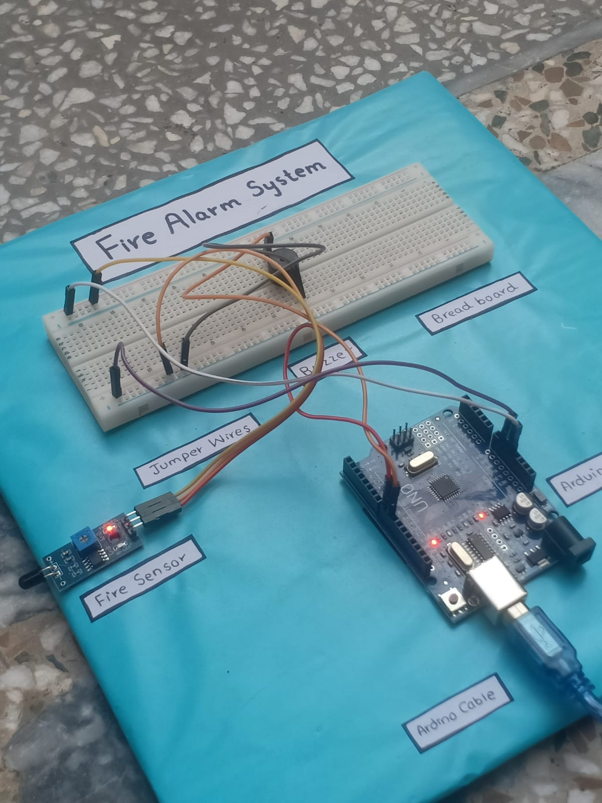
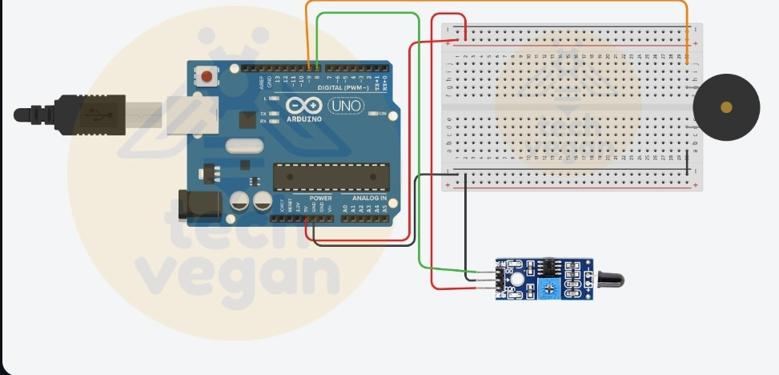

# Project-Fire-Alarm-System
A Digital Logic Design project demonstrating a Fire Alarm System using Arduino UNO, Flame Sensor, and Buzzer to detect and respond to fire emergencies.

## Project Overview
The Fire Alarm System is a critical safety project developed as part of the Digital Logic Design (DLD) course at Abbottabad University of Science and Technology. The system is designed to detect fire and trigger an alarm using basic electronic components, providing an early warning system for potential fire hazards.

## Components Used
- *Flame Sensor:* Detects the presence of flames by sensing infrared radiation emitted by fire.
- *Microcontroller (Arduino UNO):* Processes sensor data and controls the alarm system.
- *Buzzer:* Produces a loud sound when activated to alert occupants of a fire.
- *Breadboard and Jumper Wires:* Used to prototype and connect the components.

## Working Principle
- The flame sensor continuously monitors the surroundings for flames.
- Upon detecting fire, the sensor sends a signal to the Arduino UNO.
- The Arduino processes the signal and activates the buzzer to alert occupants.

## Assembly Instructions
1. *Setting Up the Breadboard:* Place the breadboard on a flat surface.
2. *Connecting the Arduino UNO:* Position the Arduino UNO on the breadboard, aligning its pins correctly.
3. *Attaching Sensors:* Insert the Flame Sensor into the breadboard, ensuring proper pin connections.
4. *Integrating the Buzzer:* Insert the buzzer into the breadboard.
5. *Wiring the Components:* Use jumper wires to connect all components according to the circuit diagram.
6. *Powering the System:* Power the Arduino UNO via USB or an external source.
7. *Uploading the Code:* Write and upload the code using the Arduino IDE.
8. *Testing the System:* Simulate fire conditions to test the system and ensure proper functionality.

## Testing and Troubleshooting
- Test the system by simulating a fire or subjecting it to high temperatures.
- Troubleshoot any issues related to wiring or sensor calibration.

## Project Hardware

## Circuit Diagram

## Project Video
Watch the project video here: [Project Video](Project_video.mp4)

## Project Code
The Arduino code for the Fire Alarm System can be found [here](Project_code.ino).

## Conclusion
The Fire Alarm System project successfully integrates basic digital logic principles to create a functional fire detection and alert system. By combining a flame sensor, Arduino UNO, and buzzer, the project demonstrates effective early fire detection and alarm capabilities, providing valuable hands-on experience in both hardware and software aspects of digital design
